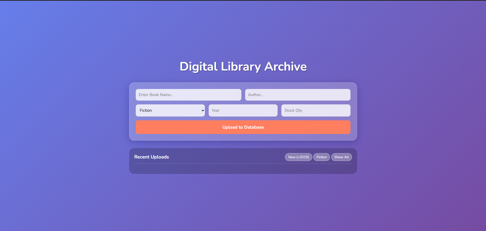
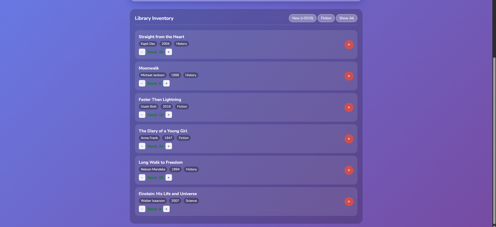
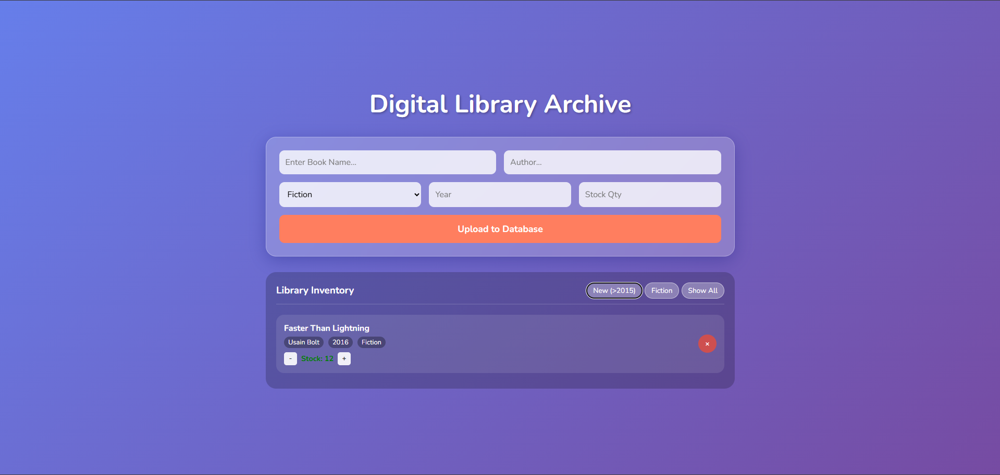
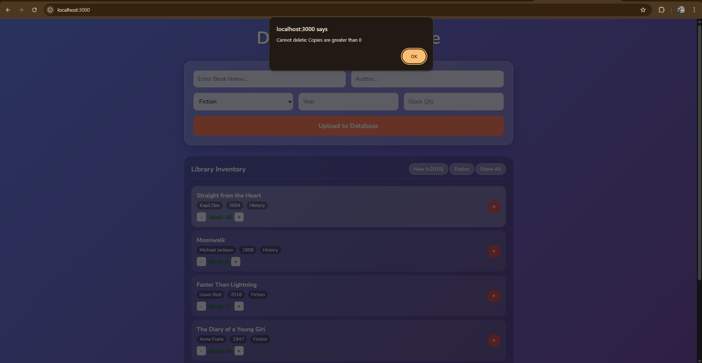
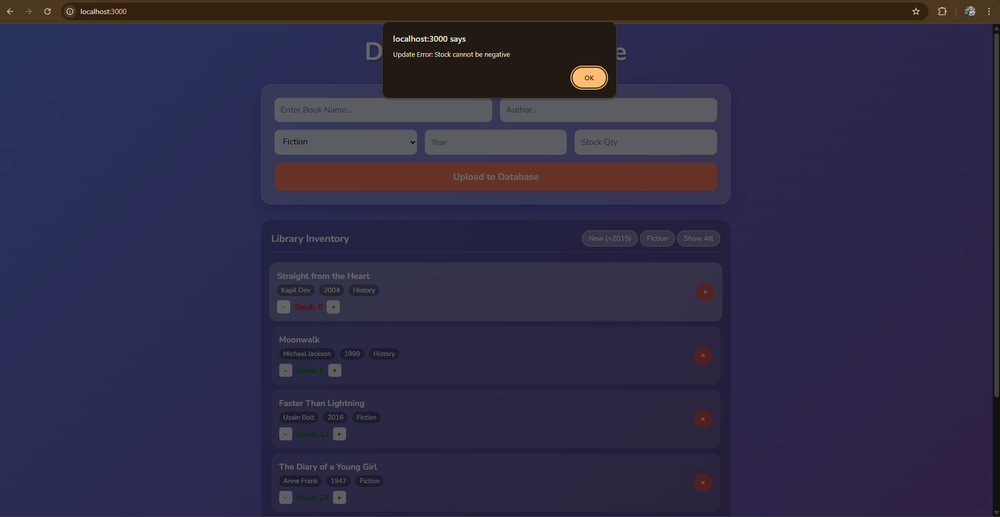

# 🐝 BookHive - Digital Library Archive

## 📌 Project Overview
**BookHive** is a modern, full-stack library management system featuring a **Glassmorphism UI** (translucent cards with vibrant gradients). It allows administrators to archive books, manage inventory in real-time, and filter records dynamically.

The project demonstrates secure **CRUD operations** (Create, Read, Update, Delete) with a Node.js/Express backend and MongoDB database.

---
---

## 🛠️ Tech Stack
- **Frontend:** HTML5, CSS3 (Glassmorphism), Vanilla JavaScript
- **Backend:** Node.js, Express.js
- **Database:** MongoDB (Mongoose ODM)

---
### ⚡ Core Functionalities
- **Add Books:** Archive new titles with metadata (Author, Year, Category, Stock).
- **Smart Filters (Read):**
  - **New Arrivals:** One-click filter to show only books published after **2015**.
  - **Category Filter:** dedicated view for "Fiction" books.
- **Inventory Control (Update):**
  - Interactive `[+]` and `[-]` buttons to adjust stock instantly.
  - **Safety Check:** Backend prevents stock from dropping below zero.
- **Secure Deletion (Delete):**
  - **Constraint:** System blocks deletion if the book currently has active stock (`Copies > 0`).

---
## 📸 Project Screenshots (Testing)

### 1. Dashboard & Create Operation
**Condition Met:** "Insert minimum 7 books" & "Read All"

### 2. Filtering Logic (New > 2015)
**Condition Met:** "Books after year 2015"
*Below: The result of clicking 'Show New'. Only recent books like 'Faster Than Lightning' (2016) are visible.*

### 3. Delete Restriction (Error Handling)
**Condition Met:** "Remove book if copies = 0"
*Below: Browser alert preventing the deletion of a book that is still in stock.*

### 4. Negative Stock Prevention (Error Handling)
**Condition Met:** "Negative stock prevention"
*Below: The system prevents decreasing stock below zero.*

